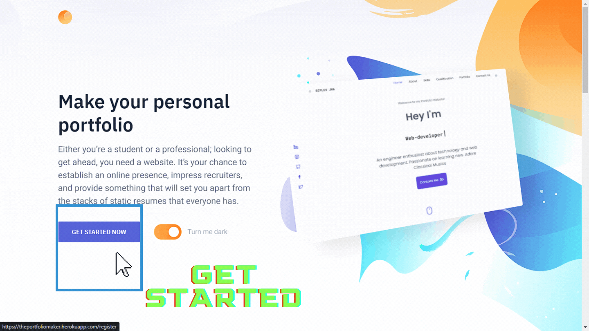

 # The Portfolio Maker

## Objective: 
“The Portfolio Maker” is a site where people can enter their information and obtain their own personal portfolio site. 

## Overview:
Websites aren’t just for businesses. They can also help you make yourself visible. A personal website can become a funnel through which you express yourself, showcase your portfolio, or highlight your areas of expertise. 

Everyone, despite their field, needs a personal website. An entrepreneur, freelancer, teacher, student, recent graduate, expounds upon the value of a personal website. Whether one is applying for a new job or starting a side project, most people will search for them online. Sometimes one searches himself online to determine how is one’s presence and how can someone reach us. Moreover, having control over what information one would like to share(including one’s achievement) is a very powerful thing.

People who are considering you for opportunities like speaking engagements, training, freelance gigs, consulting will expect you to have a personal website. They want quick proof that you’ve established yourself as a go-to person in your field. Your style, tone, and approach can signal to others whether you’d be a good fit for them.

Having your own website will definitely cultivate one’s own better self by providing better exposure and a great online presence. The more extensive one’s site is, the better impression one can make -- and reaching more people means more connections, opportunities, and so forth. A website allows you to stand out from the competition. 

A personal website can let you make your pitch in front of people you might never meet otherwise. The best time to start building a website was yesterday, but the second-best time is today. Get your name out there, build a personal brand, and stay competitive.

“The Portfolio Maker” aims to ease the process. It provides a simple interface where interested ones can sign up, enter their information and we get their shareable website right away.



&nbsp;

:computer: &nbsp; **View project live [here](https://theportfoliomaker.herokuapp.com)**

:arrow_forward: &nbsp; **View Video Presenation [here](https://youtu.be/N2Q66QBJ5aM)**

&nbsp;


## Distinctiveness and Complexity

This project is one of a kind attempt which is completely distinct from any prior submissions. This project is about making users Portfolio Site. The basic idea is to have user sign up, enter their details and then display those information in a beautiful manner; thereby creating a portfolio site. Additionally user also gain access to API of their entered information as well. This project provides CRUD (Create/Retrieve/Update/Delete) facility to the user in order to manage and update their informations as per their need. The application is in no way similar to the idea of a social network project or e-commerce site. The application utilizes Django (6 models) on the backend and Javascript for the front-end. The application is mobile-responsive as well.


## Structure:
The project is structured as follows
- Portfolio_maker: This is the main Django ‘startproject’ folder
- Static: This folder contains the front end static portions (CSS/JS) files
- Staticfiles: Upon performing ‘collectstatic command’, this folder is created. During hosting the static files in this folder are utilized 
- Templates: This contains the HTML templates for this project
- User_interface: This is the app created using django.


## File Contents:

### Front End
Contains CSS, JS, images, bootstraps, HTML files
- ``` ./static/css ``` -  Contains Static files for Login page
  - ` loginStyles.css ` and ` styles.css` - CSS elements for Login/SignUp template
- `./static/dist` - Contains Static files for Landing Page
  - `css/style.css ` - CSS elements for landing pages
  - `images/*all ` - Images used on landing pages
  - `js/main.min.js` - JS elements for landing pages
- `./static/createForm` - Contains Static files for the Create/Update/Delete templates Form portion
  - `css/*all` - CSS Styling for Create/Update/Delete templates Form portion
  - `fonts/*all ` - Fonts used for Create/Update/Delete templates Form portion
  - `images/*all ` - Images used for Create/Update/Delete templates Form portion
  - `js/*all ` - JS elements used for Create/Update/Delete templates Form portion
  - `vendor/*all ` - Animation, icons, scroll bar, jquery, bootstrap elements  used for Create/Update/Delete templates Form portion
- `./static/portfolioCSS ` - Contains Static files for the Portfolio Template
  - `assets/*all` - CV, images used for the portfolio template portion
  - `css/argon-design-system.min.css` - Argon design system used for the portfolio template portion
  - `css/style.css` - CSS Styling used for the portfolio template portion
  - `js/*all` - JS elements, Typewriter effect, Argon design JS, etc used for the portfolio template portion
-  `./templates/user_interface/index.html` -  HTML template for landing page
- `./templates/user_interface/portfolio.html` -  HTML template for portfolio / READ /OUTPUT page
- `./templates/user_interface/loginRegister.html` -  HTML template for login and signup page
- `./templates/user_interface/create.html` - HTML template for complete CREATE portion
- `./templates/user_interface/create_layout.html` - Layout for CREATE portion
- `./templates/user_interface/information_create.html` -  HTML template for information CREATE portion
- `./templates/user_interface/education_create.html` -  HTML template for education CREATE portion 
- `./templates/user_interface/experience_create.html` -  HTML template for experience CREATE portion
- `./templates/user_interface/skill_create.html` -  HTML template for skillset CREATE portion
- `./templates/user_interface/project_create.html` -  HTML template for project portfolio CREATE portion
- `./templates/user_interface/delete.html` -  HTML template for DELETE related portion
- `./templates/user_interface/update/*all` -  HTML templates for related to UPDATE portion


### Back End
Contains Views.py, Forms.py, Admin.py, Serializer.py, URLS.py, Models.py files
The Models in the application are :
- `User` - A fully featured User model with admin-compliant permissions.

- `InformationModel` - Holds the regular information about the user

- `EducationModel` - Holds the education-related information about the user

- `ExperienceModel` - Holds the experience-related information about the user

- `SkillsetModel` - Holds the skillsets related information about the user

- `ProjectModel` - Holds the information related to projects done by the user

- `MessageModel` -Used to hold the contact information so that anyone who wants to contact the user from the portfolio template can be done

## Installations and how to run
Please see the appropriate guide for your environment of choice.
- `py -m venv env`

- `pip install -r requirements.txt`

- `python manage.py makemigrations user_interface`

- `python manage.py migrate`

- `python manage.py runserver`


&nbsp;
### Contribute

Contributions are always welcome! Please create a PR to contribute.

### :pencil: &nbsp; License

This project is licensed under [MIT](https://opensource.org/licenses/MIT) license.


### :man_astronaut: &nbsp; Show your support

Give a ⭐️ if this project helped you!
